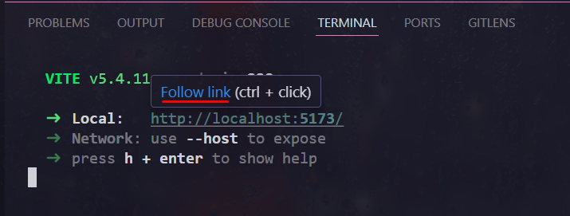

# Desafio API GitHub
Realização de 2 desafios do módulo de "base-do-react" do curso [DevQuest](https://devemdobro.com/) utilizando componentes do React <br>
_Obs: no meu caso criei meu projeto com Vite.js - por ser mais leve que o "create-react-app"_

## Solicitações

### 🧑‍🎨 Desafio 1 

1 - Dê um bom nome ao seu componente;

2 - Faça o componente renderizar na tela um parágrafo colorido
e com todas as letras maiúsculas usando JS;

3 - Utilize props para passar o texto e a cor de texto desejada
para dentro do componente (a cor pode ser uma palavra, como
'red', ou um hexadecimal);

4 - Pode utilizar o style inline para colorir o componente da forma
que foi mostrado nas aulas;

Se ficar com dúvidas revise as aulas.

### ✉️ Desafio 2

Crie um componente Button com um evento de clique que
apresente um alerta informando a prop label do botão que
foi clicado, com a seguinte mensagem: "A label desse botão é
<insira a label aqui via JS>".

Exemplo:
Com um botão com essa label:

```
<Button label="Baixar CV" />
```
Ao clicar no botão deve mostrar um alert com a mensagem
"A label desse botão é Baixar CV"

<br>
<br>

# Minha Resolução 👩‍💻


**[Clique aqui](https://amandameneghini.github.io/base-do-react/) para visualizar**

### Tecnologias Utilizadas 🛠

<div style="display: flex">
    
    
    
    
    
</div>
 

## Como utiliza 🥸☝️

**1. Crie uma pasta em que deseja clonar o repositório.** 📁

**2. Com a pasta aberta clique nela e com o botão direito do mouse selecione a opção "Git Bash HERE" ou "Abrir no terminal"** 📂

**3. Clone o projeto (no prompt de comando):** 

```
git clone https://github.com/AmandaMeneghini/desafio-api-github.git
```

**4. Acesse a pasta do projeto:** 

```
cd desafio-api-github
```

**5. Abra o código no VS Code:**

```
code .
```

**6. Com o projeto aberto no "Visual Studio Code", abra o terminal;**

Terminal > New Terminal <br> Ou
Exibir > Terminal 

Ou 

O atalho ⌨️

```
Ctrl + '
```

**7. Veja se tem o gerenciador de pacotes NPM instalado;**

```
npm -version
```
_Obs: se não aparecer uma versão (exemplo: 10.9.0), instale [aqui](https://nodejs.org/pt)_


**8. Verifique também se tem o node instalado na sua máquina;**

```
node -v
```
_Obs: se não aparecer uma versão (exemplo: v20.12.2), instale [aqui](https://nodejs.org/pt)_

**9. Instale todas as dependências dos pacotes, pasta "node_modules";** 
 ```
 npm install
 ```
**10. Rode o projeto;** 🚀
```
npm run dev 
```

**11. Aparecerá um endereço de URL no terminal;**

**12. Clique com **Ctrl + click** ou passe o mouse em cima do endereço, exemplo: " http://localhost:5173/"**



<hr>

# Nota 📝

&nbsp;Para conseguir fazer o [deploy](https://amandameneghini.github.io/base-do-react/), tiver que criar uma branch "gh-pages", apenas para essa finalidade</p>

 <br>

## 🗂 Estrutura do Projeto (branch main)
```
/
├── public/               # favicon Vite
|
├── src/                  # Código-fonte principal
│   ├── assets/           # Arquivos estáticos (imagens, ícones, etc.)
│   ├── components/       # Componentes React reutilizáveis
│   │   ├── button/       # Componente de botão
│   │   ├── buttons/      # Componente que agrupa múltiplos botões
│   │   └── paragraph/    # Componente do parágrafo estilizado
│   │    
│   ├── App.jsx           # Componente raiz da aplicação
│   └── main.jsx          # Ponto de entrada do React
│
│
├── .github/              # Configurações do GitHub Actions
│   └── workflows/        # Workflows de deploy e CI*/CD*
│
├── package.json          # Configurações do projeto e dependências
├── vite.config.js        # Configuração do Vite
├── README.md             # Este arquivo
└── ...                   # Outros arquivos de configuração e documentação

    
```
_*Continuous Integration (Integração Contínua)_ <br>
_*Continuous Deployment/Delivery (Entrega/Implantação Contínua)_

<hr>

## 👨‍💻 Autora

<p>
    
    <p>&nbsp&nbsp&nbspAmanda Meneghini<br>
    &nbsp&nbsp&nbsp
    <a href="https://github.com/AmandaMeneghini" target="_blank">GitHub</a>&nbsp;|&nbsp;
    <a href="https://www.linkedin.com/in/amanda-meneghini/" target="_blank">LinkedIn</a>
    &nbsp;&nbsp;
    </p>
<br><br>


 **Obrigada** por 👀 até aqui 💛 by [Amanda Meneghini](https://github.com/AmandaMeneghini)